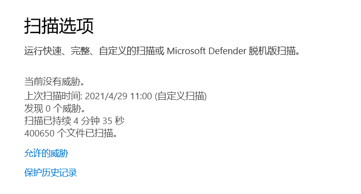

#### 能过Defender、360、腾讯
#### 不能过火绒

Kali下安装完go环境后，借助项目https://github.com/hack2fun/BypassAV

1、插件导入CS后，勾选x64的shellcode，能够生成exe  
2、拷贝到宿主机后，使用Defender扫描，未检测为病毒，如下图  
  
3、拷贝到装有360、火绒、腾讯的虚拟机下测试，只有火绒检测为病毒，如下图  
  
