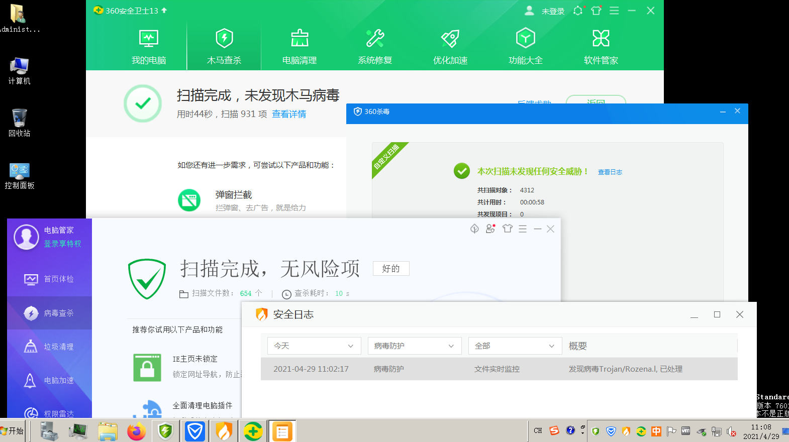

#### 能过360、腾讯，不能过Defender、火绒

Kali下安装完go环境后，借助项目https://github.com/hack2fun/BypassAV

1、插件导入CS后，勾选x64的shellcode，能够生成exe  
2、拷贝到宿主机后，使用Defender扫描（关闭可疑文件自动上传），未检测为病毒，但执行的时候会提示病毒  
3、拷贝到装有360、火绒、腾讯的虚拟机下测试（全部关闭可疑文件自动上传、用户体验改善计划、可疑网址自动上传），只有火绒检测为病毒，如下图  
  
4、关闭火绒保留360、腾讯，执行shellcode，成功上线CS，如下图  

