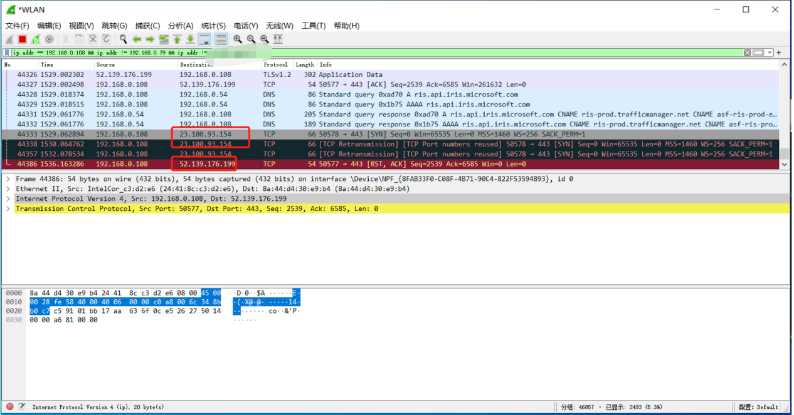
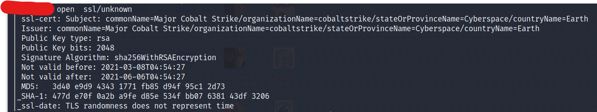

# 0x01 CS服务端搭建
将CS4.5安装包上传到VPS上，执行如下命令即可启动，需要注意，IP地址不能是0.0.0.0
```
./teamserver 192.168.0.125 password
```

# 0x02 CS服务端特征去除
## 01 修改teamserver默认端口
打开文件teamserver，将默认的50050端口改为其他端口
## 02 修改teamserver默认指纹信息
打开文件teamserver，默认的是cobalt strike信息
```
CN=Major Cobalt Strike, OU=AdvancedPenTesting, O=cobaltstrike, L=Somewhere, S=Cyberspace, C=Earth
```
此处的信息在SSL证书中可以看到，需要修改一下，可改为其他内容
```
CN=baidu, OU=baidu, O=baidu, L=baidu, S=baidu, C=baidu

或者自定义完整的内容，国家、城市等信息
```

# 0x03 CS隐藏真实IP
思路：基于CDN隐藏真实IP
## 步骤1 注册一个域名
有的文章提到使用www.freenom.com平台进行注册，我这边测试从freenom注册免费域名挺费劲的，试了几次都没成功，建议从namesilo购买一个域名，选一个不那么大众化的，每年0.99$
## 步骤2 cdn平台配置dns解析
域名注册完成后先不要解析，开始cdn平台的配置，cdn采用cloudfalre（毕竟它可以免费），地址：(https://dash.cloudflare.com/)[https://dash.cloudflare.com/]，没有账号的需要注册一下  
进入cloudflare平台后，点击左侧的网站，然后添加一个域名，这里添加的域名就是namesilo注册的域名  
  
站点添加完成后，点击站点进去，在左侧DNS中添加记录  
  
添加完成后如果出现下面这样的告警，就代表在namesilo平台中还没有修改ns记录，需要去将ns记录修改为cdn平台的  
  
进入namesilo平台修改ns记录，这里要填写的ns名称是cdn平台给分配的，参见上图，namesilo改好记录后，再到cdn平台上点击上图的“检查名称服务器”即可更新完成，此时再去解析域名、ping域名，都会成功返回到cdn的ip地址

# 0x04 CS上线微信提醒