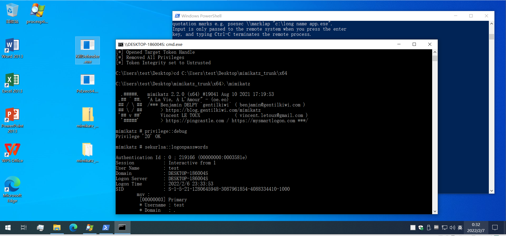

# 缺点
需要system权限

# 优点
Defender失效后，没有任何反应，适合高端钓鱼

# 基本原理
去掉MsMpEng.exe（Defender进程）的token的privilege和integrity，由于没有对这个行为做限制，只要system权限都可以

# 参考链接
https://elastic.github.io/security-research/whitepapers/2022/02/02.sandboxing-antimalware-products-for-fun-and-profit/article/  
https://github.com/pwn1sher/KillDefender

# 复现背景
测试时间：2022/02/07  
测试版本：Win10 20H2

# 复现过程
通过Process Explorer查看一下MsMpEng.exe这个进程的token的privilege和integrity，如下图圈出部分  
  
将mimikatz_trunk.zip拷贝到虚拟机，能看到被拦截  
  
经测试，普通用户权限控制台、管理员权限控制台执行后均失败，如下图  
  
通过psexec获取system权限，执行KillDefender.exe，此时不再失败，如下图  
  
再次通过Process Explorer查看一下MsMpEng.exe这个进程的token的privilege和integrity，如下图  
  
拷贝mimikatz_trunk.zip，执行mimikatz均不再拦截，如下图  
  