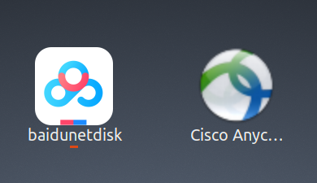
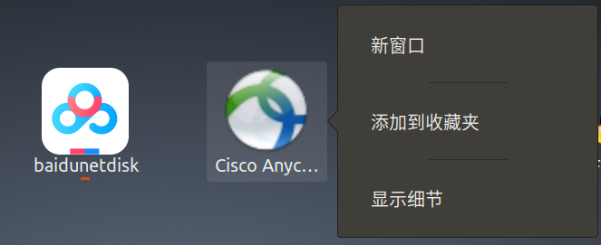

参考了几篇博客在/usr/share/applications/下写了anyconnect.desktop如下
```
[Desktop Entry]
Name=AnyConnect
Exec=path_to_vpnui
Terminal=false
Type=Application
Icon=path_to_vpnui48.png
#StartupWMClass=baidunetdisk
#Comment=百度网盘
#MimeType=x-scheme-handler/baiduyunguanjia;
#Categories=Network;
```
结果双击anyconnect.desktop后仍不能将启动的anyconnect固定到侧边栏

正当无从下手时，随手点开左下角的“显示应用程序”，看到出现了Cisco AnyConnect的图标，如下图  
  
右键点击图标，竟然出现了“固定到收藏夹的选项”，如下图  
  
好吧，幸运的把问题解决了  

wps在/usr/share/applications/下有配置文件，之前一直不能固定，用上述同样的方法也可固定

上述操作执行完是能将Cisco AnyConnect固定到侧边栏，但每次执行后会启动2个图标，有点烦人，解决方案如下  
启动软件后执行：xprop|grep "WM_CLASS"，鼠标光标会变成十字准心，点击已经打开的软件界面。将结果的第一个字符串填入 StartupWMClass

参考链接：  
https://ld246.com/article/1566260308576
