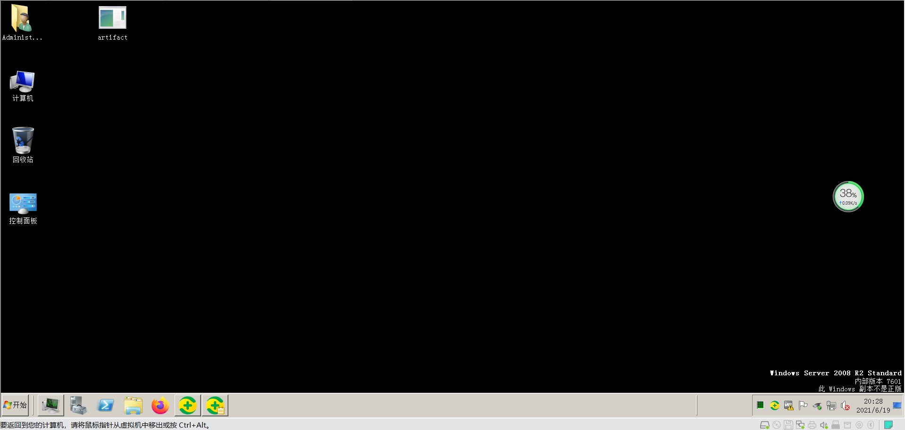

### 基本原理
利用内存中执行的特点可绕过360的动态免杀 
先决条件：CS实现静态免杀

### 过程记录
受害虚拟机：Windows 2008 R2安装360安全卫士

CS中生成exe，拷贝到受害虚拟机，执行时会被拦截，添加白名单（本次实验主要测试动态免杀，静态免杀采用白名单的形式）

CS上线后，执行Access->Run Mimikatz可导出密码，如下图  
  
受害虚拟机上无反应，如下图  

