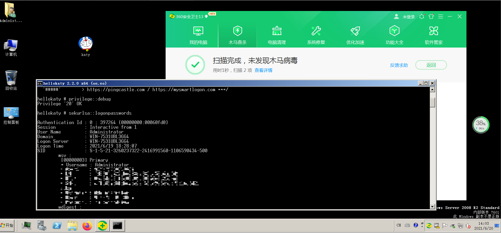

### 0x00 基本原理
修改mimikatz的特征来绕过杀软查杀  
编译后的mimikatz-x64被上传到当前目录下：katy-x64.exe

### 0x01 测试360安全卫士过程记录
受害机：Windows 2008 R2安装360安全卫士
mimikatz编译过程见[编译过程记录](./编译过程记录.md)  
1、编辑->查找和替换->在文件中替换，查找选项中不勾选“区分大小写”、不勾选“全字匹配”，将mimikatz替换为hellokaty，共替换326处，如下图  
  
2、将mimikatz.c、mimikatz.h、mimikatz.ico、mimikatz.rc改为hellokaty.c、hellokaty.h、hellokaty.ico、hellokaty.rc  
3、将作者名字Benjamin DELPY替换为Cenjamax REPLY  
4、将（可能是作者网名）gentilkiwi替换为centilkiyi  
5、将作者个人网站blog.gentilkiwi.com替换为up.down.baidu.com  
6、替换mimikatz.ico为其他的.ico文件  
重新编译文件，并重命名编译后的文件为katy.txt，将编译后的文件上传到受害机，能够绕过静态查杀及动态查杀，如下图  
  

### 0x01 测试火绒过程记录
受害机：Windows 2008 R2安装火绒  
同样的样本，会被火绒查杀，如下图  
  
